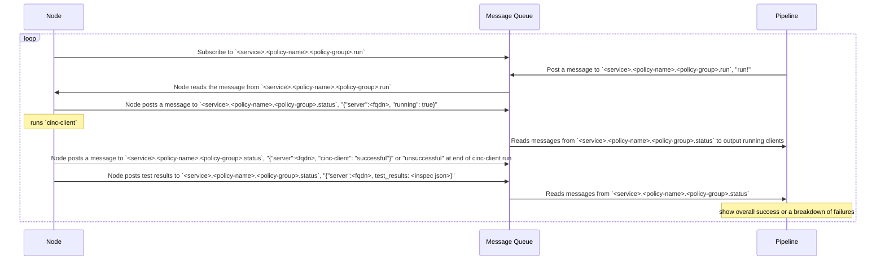

# nudge

Not as forceful as a push.

## Design

The `Node` is a Chef node running `nudge` as a service.
The `Message Queue` is a server running [nats message queue](https://nats.io/).
`Pipeline` is a CI job running `nudge` to interact with the queue.

## NATS Subject setup

- service
  - \*.\*.run
    - pipeline (environment split?) write
  - \*.\*.status
    - pipeline read
  - policy-name.policy-group.run
    - nodes read
  - policy-name.policy-group.status
    - nodes write
